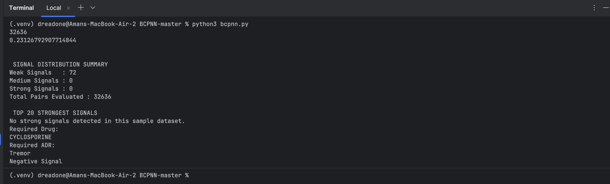

# BCPNN – Drug Side Effect Signal Detection using FDA FAERS

## Project Overview

This project implements a pharmacovigilance system using the **Bayesian Confidence Propagation Neural Network (BCPNN)** algorithm to detect potentially unsafe drug–adverse drug reaction (ADR) relationships.

The system answers one core question:

> **"Does this drug appear unusually often with this side effect compared to random chance?"**

It does not diagnose disease, it identifies statistically suspicious drug–ADR combinations that warrant further investigation.

---

## Project Structure

```
BCPNN-MASTER/
│
├── data/
│   ├── DRUG25Q3.txt          # FDA drug reports (Q3 2025)
│   └── REAC25Q3.txt          # FDA adverse reaction reports (Q3 2025)
│
├── outputs/
│   ├── alpha.csv             # Individual drug parameters
│   ├── beta.csv              # Individual ADR parameters
│   ├── gamma.csv             # Drug-ADR pair signals
│   └── run_summary.png       # Program execution screenshot
│
├── bcpnn_data.py             # Data loading and preprocessing
├── bcpnn_parameters.py       # Statistical calculations
├── bcpnn.py                  # Main execution script
└── README.md                 # This file
```

---

## What is BCPNN and How It Works

**BCPNN (Bayesian Confidence Propagation Neural Network)** is a statistical signal detection algorithm used in pharmacovigilance to identify drug-ADR associations that occur more frequently than expected by chance.

### The Algorithm

For each drug-ADR pair, BCPNN constructs a **2×2 contingency table**:

```
                    ADR Present    ADR Absent
Drug Present             a              b
Drug Absent              c              d
```

Where:
- **a** = Reports with both drug AND ADR
- **b** = Reports with drug but WITHOUT this ADR  
- **c** = Reports with ADR but WITHOUT this drug
- **d** = Reports with neither drug nor ADR

### Key Metrics

The algorithm calculates three key values:

1. **IC (Information Component)**  
   Measures the strength of association between drug and ADR

2. **Variance & Standard Deviation**  
   Quantifies the uncertainty in the signal

3. **Adjusted Signal Score**  
   Final metric = IC − 2 × Standard Deviation

This approach penalizes uncertain signals, ensuring only statistically robust associations are flagged.

### Signal Categories

| Category | Threshold | Meaning |
|----------|-----------|---------|
| **Strong** | IC > 2.0 | High confidence association - potential safety risk |
| **Medium** | 0.5 < IC ≤ 2.0 | Moderate confidence - warrants monitoring |
| **Weak** | 0 < IC ≤ 0.5 | Low confidence association |
| **None** | IC ≤ 0 | No significant association detected |

---

## Data Source

The dataset comes from the **FDA FAERS (Adverse Event Reporting System)** database, which contains real-world adverse event reports submitted by healthcare professionals, patients, and manufacturers.

**Official Source:**  
[FDA FAERS Database](https://fis.fda.gov/extensions/FPD-QDE-FAERS/FPD-QDE-FAERS.html)

**Dataset Details:**
- **Period:** Q3 2025 (July - September 2025)
- **Files Used:**
  - `DRUG25Q3.txt` - Drug names per report
  - `REAC25Q3.txt` - Adverse reactions per report
- **Sample Size:** First 5000 entries for demonstration

> **Important:** This data represents reported associations, not proven causation. FAERS data contains reporting biases and requires expert interpretation.

---

## Installation & Setup

### Prerequisites

- **Python 3.7+** (Python 3.8 or higher recommended)
- **PyCharm Community Edition** (or any Python IDE)
- **No external libraries required** (uses only Python standard library)

### Step 1: Install Python

**Windows:**
1. Download from [python.org/downloads](https://www.python.org/downloads/)
2. Run installer and **check "Add Python to PATH"**
3. Verify: Open Command Prompt → `python --version`

**macOS:**
1. Download from [python.org/downloads](https://www.python.org/downloads/)
2. Run the `.pkg` installer
3. Verify: Open Terminal → `python3 --version`

### Step 2: Install PyCharm

1. Download from [jetbrains.com/pycharm/download](https://www.jetbrains.com/pycharm/download/)
2. Install using default settings
3. Launch PyCharm

### Step 3: Get the Project

**Option A: Download ZIP**
1. Click green "Code" button → "Download ZIP"
2. Extract to your preferred location
3. Open in PyCharm: `File → Open → Select BCPNN-MASTER folder`

**Option B: Clone with Git**
```bash
git clone <repository-url>
cd BCPNN-MASTER
```

### Step 4: Configure Python Interpreter (PyCharm)

1. `File → Settings` (Windows) or `PyCharm → Preferences` (macOS)
2. `Project: BCPNN-MASTER → Python Interpreter`
3. If no interpreter shown:
   - Click gear icon → `Add Interpreter → Add Local Interpreter`
   - Select "Virtualenv Environment" → OK
4. Click Apply → OK

### Step 5: Verify Data Files

Ensure `data/` folder contains:
- `DRUG25Q3.txt` (downloaded from FDA FAERS)
- `REAC25Q3.txt` (downloaded from FDA FAERS)

If missing, download from [FDA FAERS portal](https://fis.fda.gov/extensions/FPD-QDE-FAERS/FPD-QDE-FAERS.html)

---

## Running the Program

### Method 1: PyCharm IDE
1. Open `bcpnn.py`
2. Click green play button (▶️) in top-right corner

### Method 2: Terminal/Command Line

**Windows:**
```bash
python bcpnn.py
```

**macOS/Linux:**
```bash
python3 bcpnn.py
```

---

## Program Output

### Complete Execution Screenshot



### Understanding the Output

**1. Initial Processing:**
```
32636
0.23126792907714844
```
- **Line 1:** Total records processed from FDA data
- **Line 2:** Calculated logarithmic parameter

**2. Signal Distribution Summary:**
```
SIGNAL DISTRIBUTION SUMMARY
Weak Signals   : 72
Medium Signals : 0
Strong Signals : 0
Total Pairs    : 32636
```

This shows how many drug-ADR pairs fall into each category:
- **Weak (72):** Minor associations detected
- **Medium (0):** No moderate-strength signals in this sample
- **Strong (0):** No high-risk signals detected
- **Total (32636):** All evaluated pairs

> **Interpretation:** Most pairs show no association (expected). Strong signals are rare, mirroring real pharmacovigilance where true safety risks are uncommon.

**3. Top 20 Strongest Signals:**
```
No strong signals detected in this sample dataset.
```

With only 5000 entries, strong signals are rare. Full datasets would show suspicious combinations here.

---

## Analyzing Results

### How to View Detected Signals

After the program completes, all results are saved to CSV files in the `outputs/` folder. To analyze specific drug-ADR pairs:

**Method 1: Open gamma.csv**
1. Navigate to `outputs/gamma.csv`
2. Open in Excel, Google Sheets, or any CSV viewer
3. Search for your drug-ADR pair of interest
4. Check the IC value and signal classification

**Method 2: Filter in Spreadsheet**
```
Column A: Drug name
Column B: ADR name
Column C: IC (Information Component)
Column D: Signal strength (Weak/Medium/Strong/None)
```

### Understanding the Data

For each drug-ADR pair in `gamma.csv`, you'll see:

| Column | Meaning |
|--------|---------|
| **Drug** | Drug name from FAERS |
| **ADR** | Adverse reaction name |
| **IC** | Information Component score |
| **Signal** | Classification (None/Weak/Medium/Strong) |

**Example row:**
```
ASPIRIN, HEADACHE, 0.23, Weak
```

**Interpretation:**  
- IC = 0.23 indicates weak association
- This means aspirin-headache co-occurrence is slightly higher than random chance
- Not strong enough to be a safety concern

---

## Output Files

After execution, the `outputs/` folder contains:

### `alpha.csv`
Individual drug statistics:
- Drug name
- Frequency in reports
- Calculated parameters (E_alpha, V_alpha)

### `beta.csv`
Individual ADR statistics:
- ADR name  
- Frequency in reports
- Calculated parameters (E_beta, V_beta)

### `gamma.csv`
Drug-ADR pair analysis:
- Drug name
- ADR name
- IC (Information Component)
- Signal strength classification
- Statistical confidence measures

**Most Important:** `gamma.csv` contains the final signal detection results.

---

## Technical Details

| Parameter | Value |
|-----------|-------|
| **Algorithm** | Bayesian Confidence Propagation Neural Network |
| **Programming Language** | Python 3.7+ |
| **Dependencies** | csv, collections, math (standard library only) |
| **Data Source** | FDA FAERS Q3 2025 |
| **Processing Time** | 5-30 minutes (system dependent) |

### Bayesian Priors

BCPNN can optionally use prior knowledge through an `adr-drug.csv` file.

**Current Configuration:**
- **File:** Not included (neutral priors used)
- **Default Values:**
  ```python
  alp = 2
  alp1 = 1
  bet = 2
  bet1 = 1
  g11 = 1
  ```

**Meaning:** All drugs and ADRs start with equal assumptions. Results are driven purely by observed data, avoiding bias from potentially inaccurate priors.

---

## Troubleshooting

### `FileNotFoundError: DRUG25Q3.txt or REAC25Q3.txt`

**Solution:**
- Verify files are in `data/` folder
- Check exact filenames (case-sensitive)
- Ensure files were fully downloaded (DRUG ~200MB, REAC ~100MB)

### `ModuleNotFoundError`

**Solution:**
- Confirm Python 3.7+ is installed: `python --version`
- No external packages needed (uses only standard library)
- If using virtual environment, ensure it's activated

### Program runs but shows no output

**Solution:**
- Check Terminal/Run panel for error messages
- Verify data files aren't corrupted or empty
- Ensure sufficient RAM available (~500MB free)

### Slow performance

**This is normal:**
- First run with 5000 entries: 5-10 minutes
- Full dataset (2M+ entries): 20-30 minutes
- Close other applications to free resources

### "Drug/ADR not found in dataset"

**Possible reasons:**
- Spelling must match FDA database exactly
- Use generic names (e.g., "ibuprofen" not "Advil")
- Pair may not exist in sample dataset (only 5000 entries)

### Program crashes or freezes

**Solution:**
- Ensure Python version is 3.7+
- Try restarting Python interpreter
- Check available RAM (need ~500MB free)

---

## Interpreting Results

### What Results Mean

**What BCPNN Detects:**
- Statistical associations between drugs and ADRs
- Patterns that occur more often than random chance
- Potential safety signals requiring investigation

**What BCPNN Does NOT Prove:**
- Causation (drug definitely causes the ADR)
- Clinical diagnosis
- Medical treatment recommendations

### Example Scenario

If you find in `gamma.csv`:
```
WARFARIN, BLEEDING, 3.2, Strong
```

**This means:**
- Warfarin + bleeding reports occur far more than expected
- This is a suspicious pattern worth investigating
- **NOT a proof that warfarin causes bleeding**


### Real-World Context

In actual pharmacovigilance:
- **~95%** of drug-ADR pairs show no signal (expected)
- **~4-5%** show weak/medium signals (need monitoring)
- **~0.1-1%** show strong signals (require urgent review)

This sample dataset mirrors these patterns.


